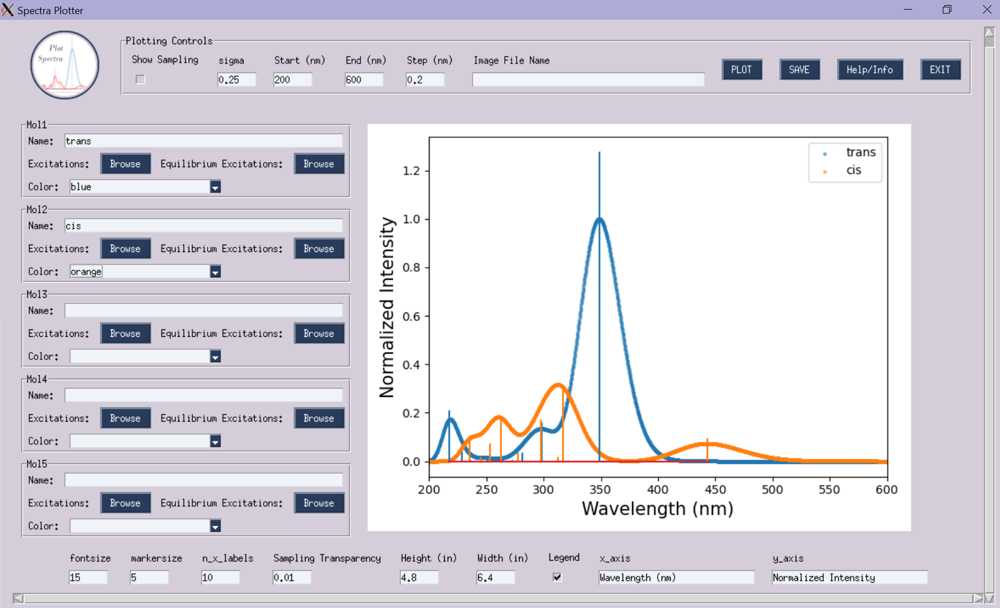

# Spectra_Plotter
A GUI and command line utility for plotting absorbance spectra from sampled non-equilibrium geometries

## Intro
This is an archive of the updated and more generalized absorbance spectra plotting script. It is broken into two scripts:
  *  **spectra_plotter.py** - script that can be run to start up a gui (`--gui` option) or takes command line arguments to plot spectra to an image file
  *  **general_spectra_plotter.py** - workhorse script that houses the actual plotting function, accepts the same command line options as the `spectra_plotter.py` script, so if the GUI packages are a dependency you don't want to install and there isn't a released binary for you this script can get run with the same comand line syntax

## GUI interface

## Command line interface
